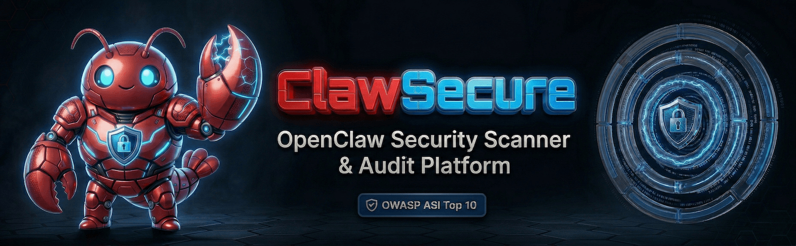
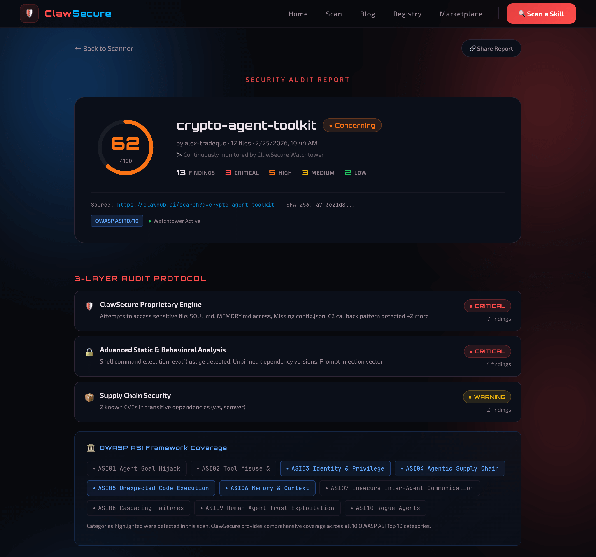

# ClawSecure — OpenClaw Security Scanner & Audit Platform

[](https://opensource.org/licenses/MIT)
[](https://www.clawsecure.ai)
[](https://www.clawsecure.ai/registry)
[](https://www.clawsecure.ai/blog/owasp-asi-top-10-guide)



**ClawSecure is the independent integrity layer for the OpenClaw ecosystem** — a free [OpenClaw security scanner](https://www.clawsecure.ai) and audit platform purpose-built for AI agent skills and workflows. We've audited 2,890+ skills from the community-curated [awesome-openclaw-skills](https://github.com/punkpeye/awesome-openclaw-skills) list and the [openclaw/skills](https://github.com/openclaw/skills) repository, covering all 10 OWASP ASI Top 10 security categories with our proprietary 3-Layer Audit Protocol.

> *"Don't just scan the file; verify the soul of the agent as it evolves."*

---

## Table of Contents

- [The OpenClaw Security Problem](#the-openclaw-security-problem)
- [OpenClaw Security Audit Features](#openclaw-security-audit-features)
- [Quick Start — Scan an OpenClaw Skill](#quick-start--scan-an-openclaw-skill)
- [OpenClaw Security Clearance API](#openclaw-security-clearance-api)
- [OWASP ASI Top 10 Coverage for OpenClaw](#owasp-asi-top-10-coverage-for-openclaw)
- [Why ClawSecure for OpenClaw Security](#why-clawsecure-for-openclaw-security)
- [OpenClaw Security Research and Reports](#openclaw-security-research-and-reports)
- [Contributing to OpenClaw Security](#contributing-to-openclaw-security)
- [About ClawSecure](#about-clawsecure)

---

## The OpenClaw Security Problem

OpenClaw is one of the fastest-growing open-source AI agent frameworks, with 180K+ GitHub stars and 2.2M+ deployed agent instances. That growth has made it a high-value target. ClawSecure's audit of the most popular skills found that **41% contain at least one security vulnerability** — ranging from credential harvesting to unauthorized network calls.

The threats facing OpenClaw users go beyond traditional malware. Palo Alto Networks (2026) identified the **Lethal Trifecta** — the convergence of private data access, untrusted content exposure, and external communication capabilities — as the defining risk pattern for AI agents. OpenClaw exhibits all three by design.

Key OpenClaw vulnerability patterns ClawSecure detects include:

- **ClawHavoc** — A coordinated malware campaign delivering credential stealers through professional-looking ClawHub skills
- **Supply chain poisoning** — Malicious dependencies injected into skill packages targeting npm and Python ecosystems
- **Sleeper agent attacks** — Skills that pass initial inspection but receive malicious updates post-installation
- **Prompt injection** — Hidden instructions embedded in skill metadata that manipulate agent behavior
- **Credential exfiltration** — Skills that harvest API keys, OAuth tokens, and plaintext secrets from OpenClaw configuration files

Traditional malware scanners miss these threats because they lack context about how OpenClaw agents operate. An AI skill vulnerability checker needs to understand that clipboard access, shell execution, and screenshot capture are standard agent capabilities — not automatic red flags.

---

## OpenClaw Security Audit Features

ClawSecure provides the only complete security solution covering all 10 OWASP ASI categories for OpenClaw agents. Every audit runs through our proprietary 3-Layer Audit Protocol:


**Layer 1 — Proprietary Threat Intelligence**
ClawSecure's proprietary engine analyzes skills against 55+ OpenClaw-specific threat patterns, including ClawHavoc detection, ReDoS vulnerabilities, and Context-Aware Intelligence that differentiates real threats from normal agent capabilities.

**Layer 2 — Advanced Static & Behavioral Analysis**
Deep code analysis examining execution patterns, data flow, permission requests, and behavioral indicators across skill source code, metadata, and bundled scripts.

**Layer 3 — Supply Chain Security**
Comprehensive dependency auditing across npm, PyPI, and other package ecosystems, cross-referencing known CVEs and vulnerability databases to catch poisoned dependencies before they execute.

### Full Capability List

| Capability | Description |
|---|---|
| **3-Layer Audit Protocol** | Proprietary intelligence + behavioral analysis + supply chain scanning |
| **OWASP ASI Top 10 Scanner** | Comprehensive coverage across all 10 agentic security categories |
| **Watchtower 24/7 Monitoring** | Automated hash-drift detection with instant re-audit on code changes |
| **Security Clearance API** | Programmatic runtime integrity verification for developers and platforms |
| **Context-Aware Intelligence** | Ecosystem-specific threat analysis — understands what OpenClaw agents actually do |
| **Anti-Sleeper Agent Detection** | Continuous monitoring catches post-installation code modifications |
| **ClawHavoc Detection** | Purpose-built detection for the ClawHavoc malware family |
| **AI Skill Vulnerability Checker** | 55+ threat patterns purpose-built for AI agent skill analysis |
| **Verified Agent Registry** | Curated directory of skills that scored 80+ on the 3-Layer Audit |

---

## Quick Start — Scan an OpenClaw Skill

**Option 1: Scan via the web interface**

Visit the [OpenClaw security scanner](https://www.clawsecure.ai/#scan) and paste any ClawHub skill URL or upload a skill zip file. Results are delivered in seconds as a full Security Audit Report.



**Option 2: Use the Security Clearance API**

For programmatic OpenClaw security automation, integrate the [Security Clearance API](https://www.clawsecure.ai/marketplace) into your workflow to verify agent integrity before granting access to sensitive data or actions. See the [full API documentation](docs/API.md) for details.

**Option 3: Browse the Registry**

Explore [2,890+ audited OpenClaw agents](https://www.clawsecure.ai/registry) in the Verified Agent Registry. Filter by category, security score, or verification status to find trusted skills for your workflows.

---

## OpenClaw Security Clearance API

The OpenClaw Security Clearance API provides real-time programmatic integrity verification for developers and platforms building on the OpenClaw ecosystem.

### Example Request

```bash
curl -X POST https://www.clawsecure.ai/api/v1/clearance \
  -H "Content-Type: application/json" \
  -d '{
    "agent_id": "github-user/skill-name",
    "current_skill_hash": "sha256:abc123..."
  }'
```

### Example Response

```json
{
  "status": "SECURE",
  "score": 92,
  "agent_id": "github-user/skill-name",
  "last_audit": "2026-02-25T14:30:00Z",
  "report_url": "https://www.clawsecure.ai/report/abc123",
  "hash_match": true,
  "categories_covered": 10
}
```

### Status Codes

| Status | Meaning |
|---|---|
| `SECURE` | Agent passed audit and hash matches verified version |
| `UNVERIFIED` | Agent not yet audited or hash not recognized |
| `DENIED` | Agent failed critical security checks |

**Rate limit:** 100 requests/minute. Currently free and open — no API key required.

For the full endpoint reference, authentication details, and integration examples, see [docs/API.md](docs/API.md).

---

## OWASP ASI Top 10 Coverage for OpenClaw

ClawSecure provides comprehensive coverage across all 10 categories of the OWASP Agentic Security Initiative (ASI) Top 10 — the emerging security standard for AI agent systems.


| # | OWASP ASI Category | ClawSecure Coverage |
|---|---|---|
| ASI-01 | Agent Goal Hijack | Prompt injection detection in skill metadata, SKILL.md files, and bundled scripts |
| ASI-02 | Tool Misuse | Permission analysis and capability auditing for system-level tool access |
| ASI-03 | Supply Chain Attacks | Layer 3 dependency scanning across npm, PyPI, and bundled packages |
| ASI-04 | Unsafe Code Execution | Static analysis of shell commands, eval patterns, and code generation |
| ASI-05 | Rogue Agents | Behavioral fingerprinting and intent classification via Context-Aware Intelligence |
| ASI-06 | Data Exfiltration | Network call analysis detecting unauthorized data transmission patterns |
| ASI-07 | Inter-Agent Communication | Workflow handshake analysis for multi-agent swarm security |
| ASI-08 | Cascading Failures | Dependency chain analysis and supply chain cascade prevention |
| ASI-09 | Sensitive Data Exposure | Credential and secret detection in config files, environment variables, and memory |
| ASI-10 | Agent Persistence | Watchtower hash-drift monitoring for post-installation integrity verification |

For a detailed explanation of each category and how ClawSecure maps findings to the OWASP ASI framework, see [docs/OWASP-ASI.md](docs/OWASP-ASI.md). For the complete guide, read [OWASP ASI Top 10 Explained for OpenClaw Users](https://www.clawsecure.ai/blog/owasp-asi-top-10-guide) on our blog.

---

## Why ClawSecure for OpenClaw Security

**Generic scanners don't understand OpenClaw.** Traditional malware scanners flag legitimate agent tools as suspicious because they lack ecosystem context. A clipboard-access permission that's standard for an OpenClaw productivity skill gets flagged as "potentially malicious" by generic scanners — creating noise that drowns out real threats.

ClawSecure's Context-Aware Intelligence understands the OpenClaw ecosystem and differentiates real threats from normal agent capabilities. When we audited OpenClaw's own `peekaboo` skill, generic scanners flagged it as suspicious. ClawSecure gave it a 95 (Safe) — because we understand that system-level capabilities like clipboard access and shell execution are standard for any useful OpenClaw agent.

**Static scans aren't enough.** A skill that passes inspection today can receive a malicious update tomorrow. ClawSecure's Watchtower monitors all 2,890+ tracked skills 24/7 and automatically re-audits any skill whose code changes. Within 24 hours of enabling Watchtower, we detected 35 skills with modified code — and 22.9% of all tracked skills have recorded at least one hash change since initial auditing.

**No other tool covers everything.** ClawSecure is the only OpenClaw audit tool delivering 10/10 OWASP ASI coverage, real-time integrity monitoring, runtime verification via the Security Clearance API, and an AI skill vulnerability checker with 55+ threat patterns purpose-built for the agentic era.

---

## OpenClaw Security Research and Reports

- [**41% of Popular OpenClaw Skills Have Security Vulnerabilities**](https://www.clawsecure.ai/blog/41-percent-openclaw-skills-vulnerabilities) — Flagship research from the largest public security audit of the OpenClaw ecosystem
- [**ClawHavoc Explained: The Malware Family Targeting OpenClaw Agents**](https://www.clawsecure.ai/blog/clawhavoc-explained) — Deep dive into credential harvesting, C2 callbacks, and the ClawHavoc campaign
- [**OWASP ASI Top 10 Explained for OpenClaw Users**](https://www.clawsecure.ai/blog/owasp-asi-top-10-guide) — Comprehensive guide to all 10 agentic security risk categories
- [**The Sleeper Agent Problem: How Safe Skills Turn Dangerous After Installation**](https://www.clawsecure.ai/blog/sleeper-agent-problem) — Why runtime integrity monitoring matters for OpenClaw security
- [**Verified Agent Registry — Browse 2,890+ Audited Skills**](https://www.clawsecure.ai/registry) — Search, filter, and discover audited OpenClaw agents by category and security score

---

## Contributing to OpenClaw Security

We welcome contributions from the OpenClaw community. See [CONTRIBUTING.md](CONTRIBUTING.md) for details on:

- **Reporting security issues** found in OpenClaw skills
- **Submitting a skill** for scanning via the ClawSecure platform
- **Requesting features** or improvements
- **Reporting suspicious skills** through our [issue templates](.github/ISSUE_TEMPLATE/)

For security vulnerability disclosures related to ClawSecure itself, see [SECURITY.md](SECURITY.md).

---

## About ClawSecure

ClawSecure is the independent AI agent security scanner and integrity layer for AI agent skills and workflows, providing the security infrastructure the OpenClaw ecosystem needs to scale safely. With 2,890+ skills audited from the community-curated awesome-openclaw-skills list and the openclaw/skills repository, comprehensive OWASP ASI Top 10 coverage, and 24/7 Watchtower monitoring, ClawSecure delivers the audit depth and runtime verification that generic scanners cannot.

**Founded by [J.D. Salbego](https://x.com/JDSalbego)** — 2x exited founder with 10+ years building trust infrastructure for emerging technology ecosystems.

🌐 [clawsecure.ai](https://www.clawsecure.ai) · 🐦 [@ClawSecure](https://x.com/ClawSecure) · 📧 contact@clawsecure.ai

---

## License

This project is licensed under the [MIT License](LICENSE).
